# Vertigo Games – Data Analyst Case Study   
**Author:** Atamert Bilgin  
**Tools:** Python, NumPy, Pandas, Matplotlib, Jupyter Notebook, Big Query

---

## Repository Structure
```text
vertigo-ab-test-case/
│
├── README.md
├── requirements.txt
│
├── notebooks/
│   ├── task1_ab_test.ipynb            # A/B test simulation & modeling
│   └── task2_user_analysis.ipynb      # User behavior & segmentation analysis
│
├── src/
│   ├── abtest/                        # All reusable modules for Task 1
│   │   ├── __init__.py
│   │   ├── config.py                  # Constants: installs/day, ARPPU, eCPM, etc.
│   │   ├── retention.py               # Retention curve functions
│   │   ├── dau.py                     # DAU stacking & cohort simulation
│   │   ├── monetization.py            # Ad + IAP revenue models (+ sale logic)
│   │   └── scenarios.py               # Baseline, sale, and new-source scenarios
│   │
│   └── useranalysis/                  # All reusable modules for Task 2
│       ├── __init__.py
│       ├── d0_playtime_segments_retention.py      # D0 playtime retention curve + table
│       ├── d0_match_winrate_retention.py          # Match-count x win-rate retention curves
│       ├── daily_session_duration_trend.py        # Daily average session duration trend
│       ├── session_count_retention.py
│       ├── match_winrate_segments_distribution.py
│       ├── iap_ad_revenue_trend.py                # IAP-per-DAU and Ad-per-DAU trend lines
│       └── all_used_sql_files_for_big_query.txt
│
└── outputs/
    ├── figurestask1/                  # Generated figures for Task 1
    │   ├── dau_over_15_days.png
    │   ├── cumulative_rev_15days.png
    │   ├── cumulative_rev_30days.png
    │   ├── cumulative_rev_with_10day_sale.png
    │   ├── cumulative_rev_with_new_source.png
    │   └── sale_vs_new_source.png
    │
    └── figurestask2/                  # Generated figures for Task 2
        ├── d0_playtime_retention_line_with_table.png
        ├── session_count_retention_curves/         # 6 graphs by match buckets
        │   ├── 1_match_retention_curve.png
        │   ├── 2-3_matches_retention_curve.png
        │   ├── 4-7_matches_retention_curve.png
        │   ├── 8-15_matches_retention_curve.png
        │   ├── 16-30_matches_retention_curve.png
        │   └── 30+_matches_retention_curve.png
        │
        ├── daily_session_duration_trend.png
        └── iap_ad_rev_per_dau_trend.png

```


The notebook automatically imports reusable functions from src/abtest/.

### Task 1: Analysis & Findings
This analysis models an A/B test for a difficulty flow.
Each variant receives 20,000 installs/day, and we simulate:

- Cohort-based retention

- DAU (stacked by cohorts)

- Monetization (ads + IAP)

- A 10-day sale event

- A new user source starting Day 20

Retention uses linear interpolation up to D14 and exponential decay afterward.

---

### a) Which variant has more DAU after 15 days?

Variant B retains players slightly worse on Day1 but significantly better in mid- and late-game (D7, D14).
This leads to more stacked cohorts by Day 15.
Variant B has higher DAU on Day 15.

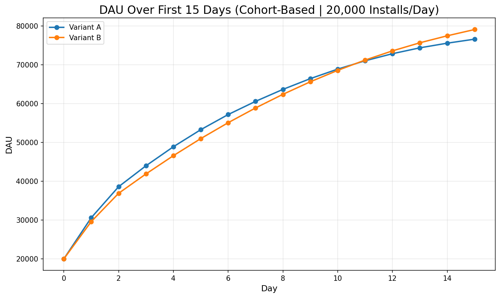

---

## b) Which variant earns more up to Day 15?
I used ARPPU = 5$ since there is no additional information in the case:

Variant A monetizes better per user (more impressions per DAU).

Variant B has more DAU but lower per-user ad revenue.

For this monetization level:

Variant A earns slightly more by Day 15.

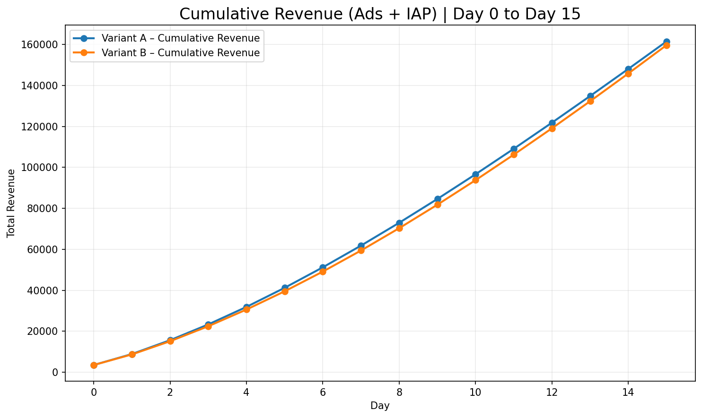

---

## c) Which variant earns more up to Day 30?
Over longer windows, retention matters much more.

Variant B’s D7/D14 advantage compounds, and by stacking more surviving cohorts, it overtakes A.

By Day 30, Variant B earns more total revenue.

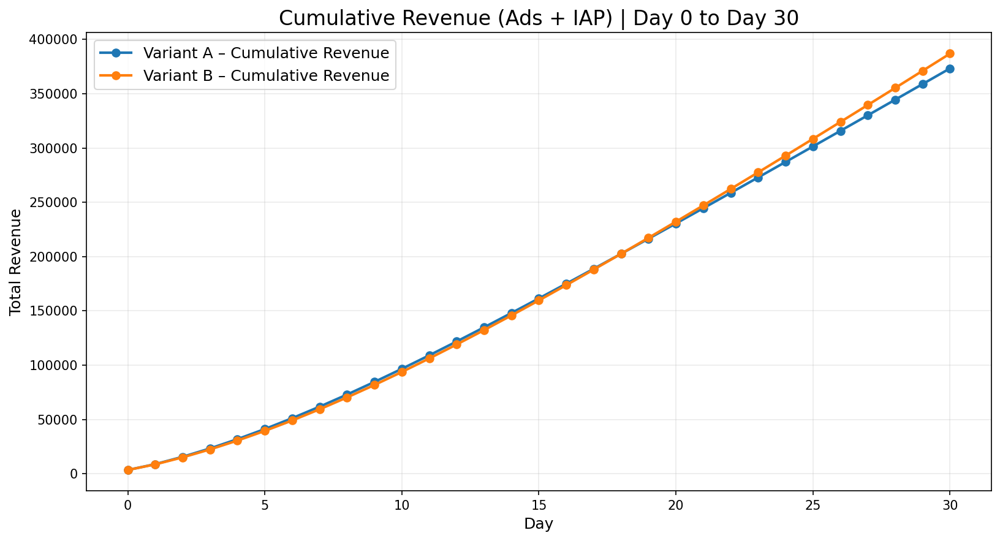

---

## d) What is the impact of a 10-Day Sale (Day 15–24)? Does this change which variant earns more total money by Day 30?
During the sale:

Purchase probability +1% absolute

DAU unchanged
IAP revenue increases sharply for 10 days
The effect is large but temporary and it does not change which variant earns more total money by Day 30.

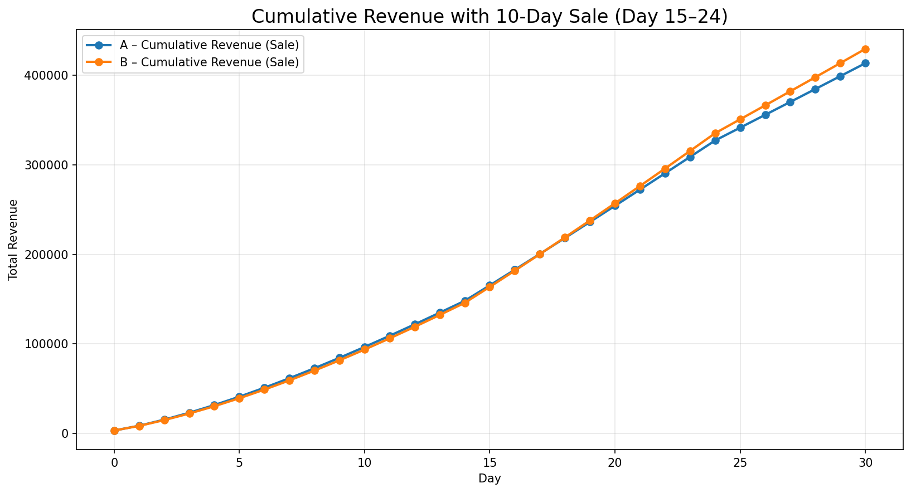

---

## e) What is the impact of a new user source (starting Day 20)?
New flow:

12k installs/day from old source

8k installs/day from new source

New source cohorts follow exponential retention
This creates a small but permanent DAU increase every day.

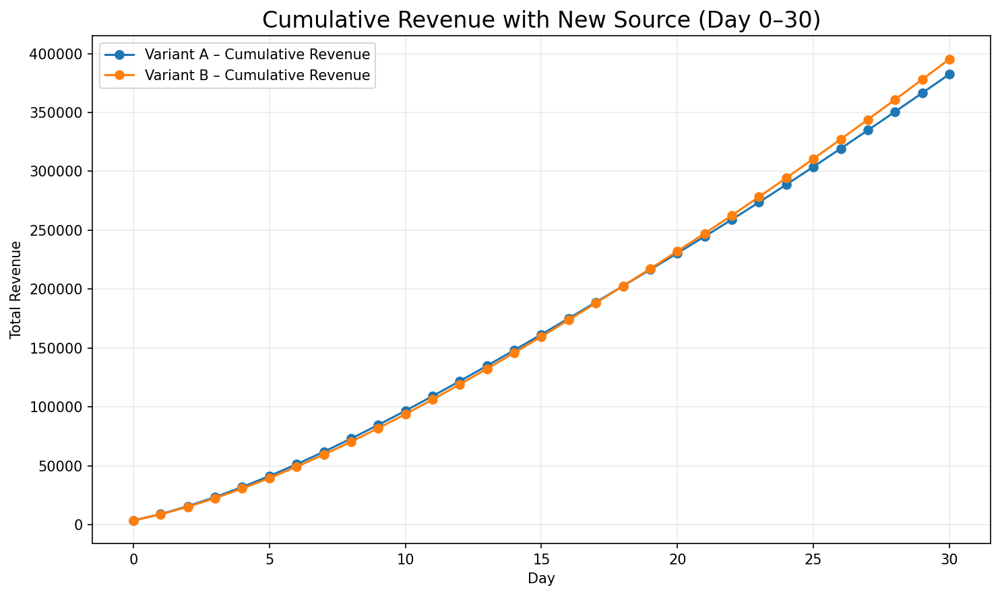

---

## f) Sale vs. New User Source — Which Should Be Prioritized?
Comparison (Variant B shown since I think it is the superior one):

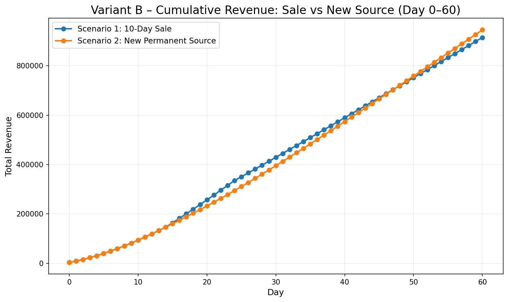

Interpretation
The 10-day sale creates a strong short-term spike and gets ahead of the curve for that period
The new user source compounds permanently more lucrative in the long run.

Over long horizons (45–90+ days), the new source dominates.

## Final Verdict

I would prioritize the permanent new user source.
A one-off sale boosts short-term IAP
a new source changes the growth trajectory of the game.

---

### Summary
Winner is Variant B since it has better long term metrics overall.

# Task 2 — User Behavior Analysis

Install Cohort: 2024-02-15 → 2024-03-15

This part of the case study analyzes how different aspects of user behavior on their first day (D0) relate to retention and long-term engagement.
In addition, I explore session duration trends and monetization trends over time.

All segmentation queries were executed in BigQuery, and all visualizations were generated using reusable Python functions under:

src/useranalysis/


Figures are stored in:

outputs/figurestask2/

## 1. D0 Playtime/Session Count Segmentation → Retention

This segmentation groups users by their total session duration / session count on the install day, then measures their retention over D1–D21.

Retention Curves by Playtime Segment

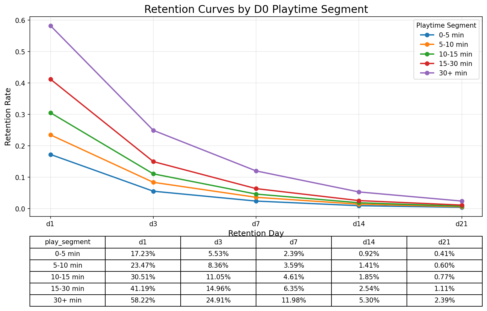

Retention Curves by Session Count Segment

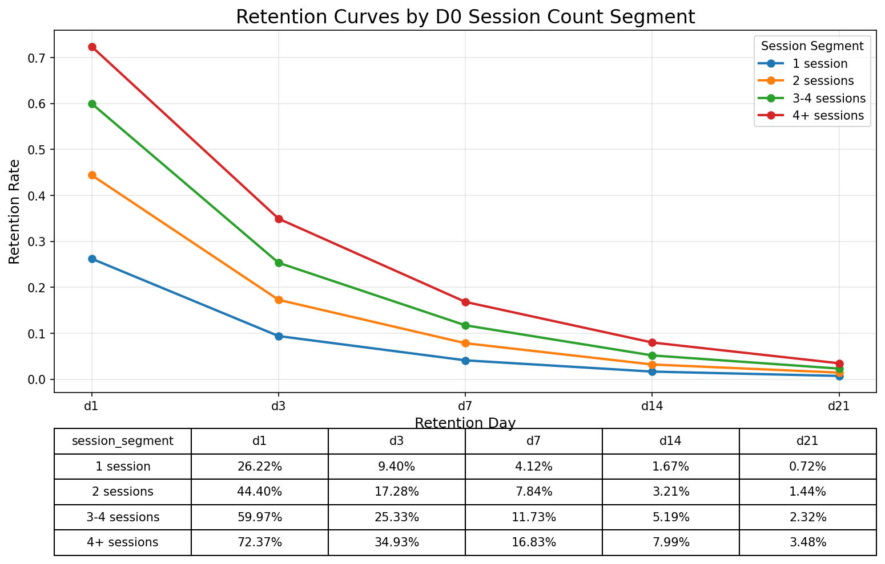

### Insights

Retention increases consistently with more D0 playtime and session counts.

Users who played 30+ minutes retained 3.4× better on D1 and ~6× better by D21 compared to those who played 0–5 minutes.

The game’s D0 experience strongly predicts long-term retention — improving onboarding, early rewards, or first-session gameplay would likely boost overall retention.

## 2. D0 Match Count × Win Rate Retention Interaction

Instead of looking at match count alone, I combine:

matches played on D0, and win-rate bucket (0–25%, 25–50%, 50–75%, 75–100%)

D0 Match Count × Win Rate User Distribution

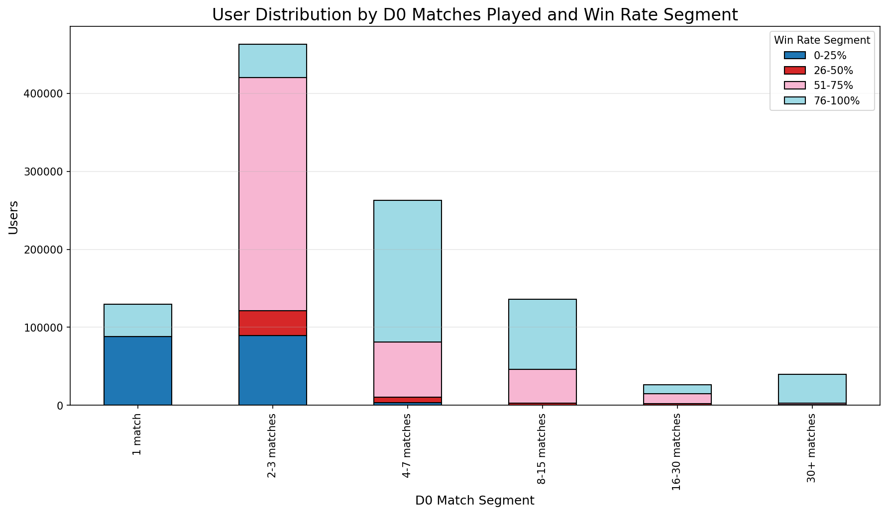

Then compute retention curves for each subgroup.

1 Match

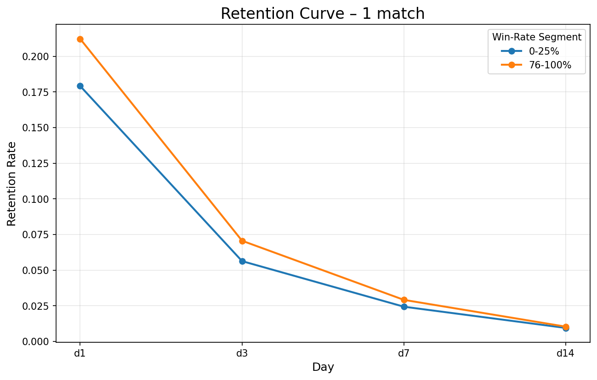

2–3 Matches

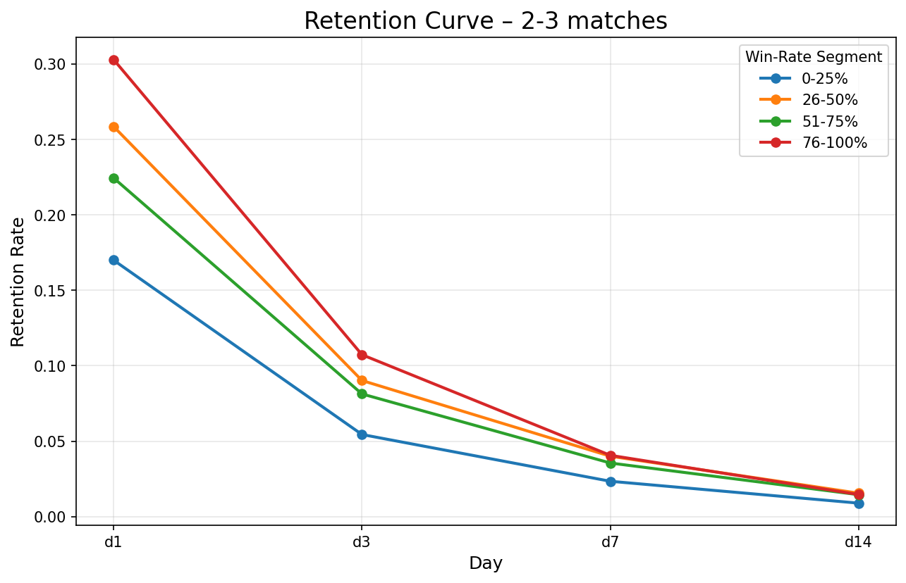

4–7 Matches

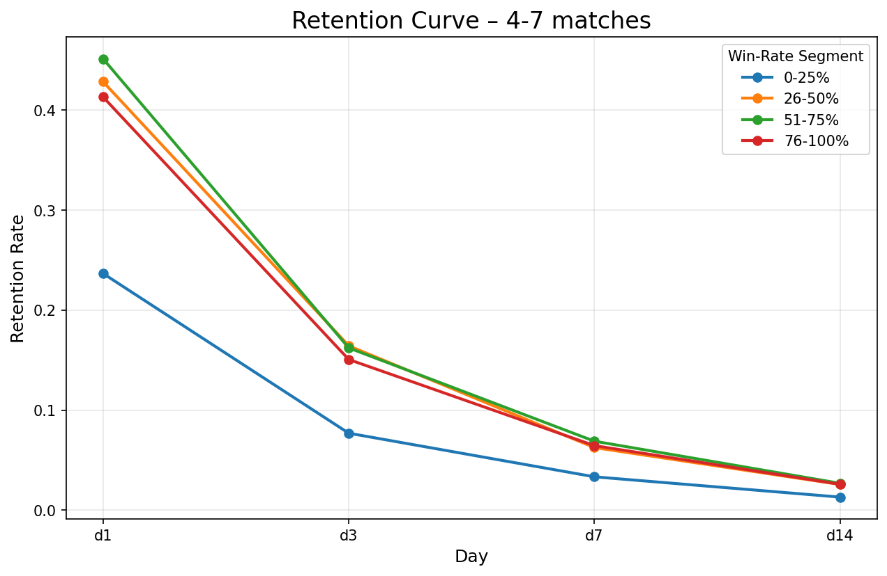

8–15 Matches


16–30 Matches

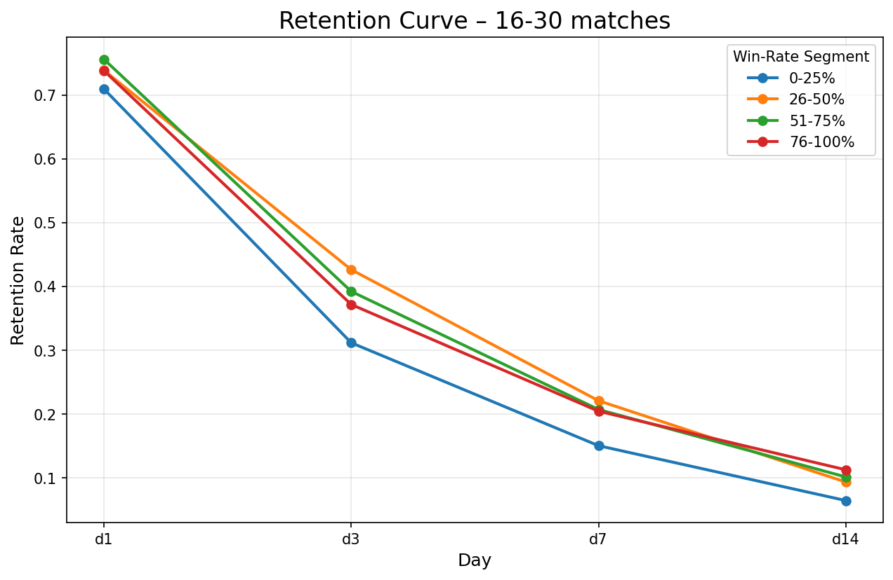

30+ Matches

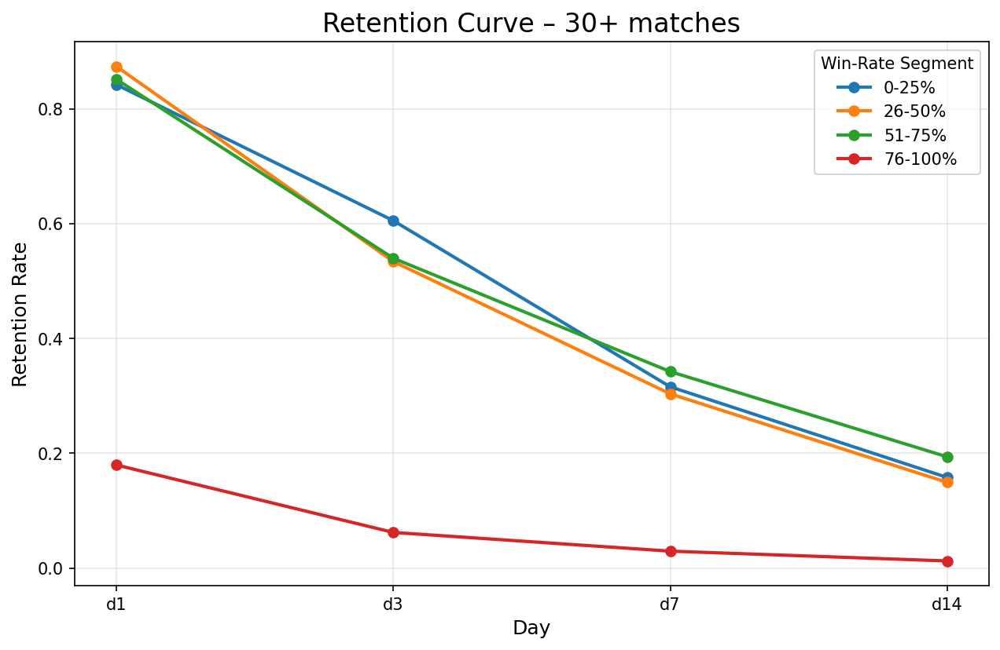

### Insights

Engaged players who play many matches on Day 0 are dramatically more likely to return. 
This suggests "early engagement loops" are working well—more matches = more stickiness.

### Win-rate matters, but much less than match count

Win-rate segmentation has a clear but secondary impact:
Within each match segment, players with higher win-rates consistently retain better.
But the difference between match-count buckets is much larger than the difference between win-rate buckets.

### Low win-rate users churn fast unless they are highly engaged

For 0–25% win-rate players:

Retention is weak in low match brackets.
But if they play enough matches (8–15 / 16–30), retention becomes very strong.

Altough, across all match-count buckets, higher win rates correlate with meaningfully better retention.

Low win-rate players show sharply lower D1/D3/D7 retention.

Important caveat: low win-rate values can occur due to missing victory events, caused by:
app crashes
force-quits
disconnects
In these cases, poor technical experience leads to structurally lower retention, which matches the observed data.

## 3. Daily Session Duration Trend

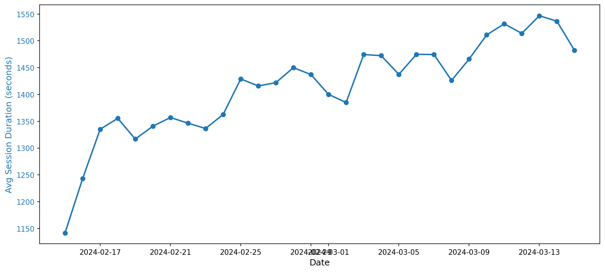

### Insights

Average session duration steadily increases throughout the month.

This may indicate:
retained users become more engaged, or
light/casual users churn early, leaving behind more dedicated players.
The trend is healthy and shows no user fatigue or decline in engagement.

## 4. IAP & Ad Monetization per DAU Trend


### Insights

IAP per DAU rises over time, possibly driven by:
- monetization strategy changes
- maturing cohorts
- more invested players staying in the game

Ad revenue per DAU stays stable, which suggests:
-no aggressive ad frequency increases
-ad monetization is healthy and not harming UX

Together, this indicates a balanced monetization model with room for controlled IAP optimization.

# Summary

This analysis shows:
Strong relationship between D0 engagement (playtime, matches, win rate) and long-term retention.
Engagement trends (session duration) and monetization trends (IAP/DAU, ads/DAU) are healthy and growing.
