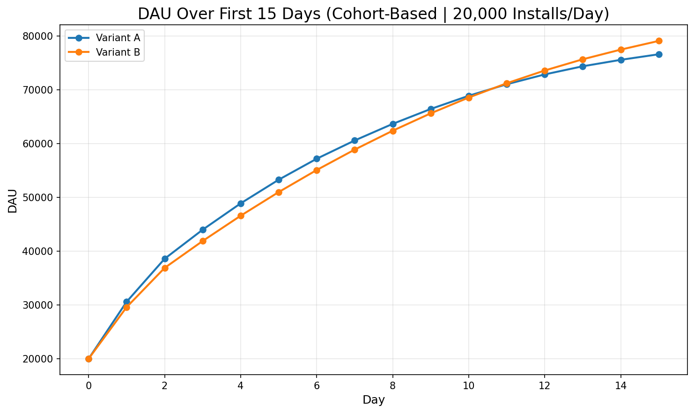
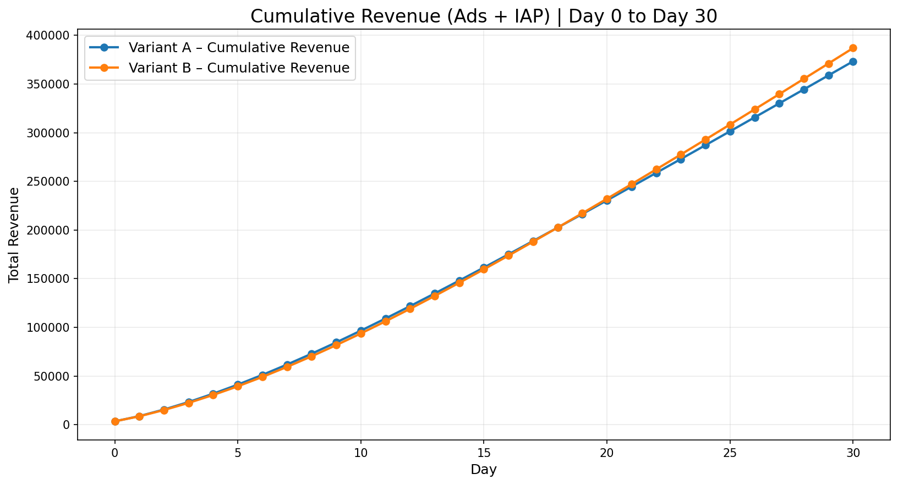
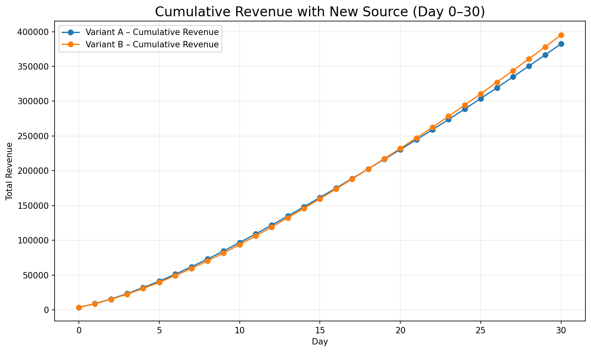
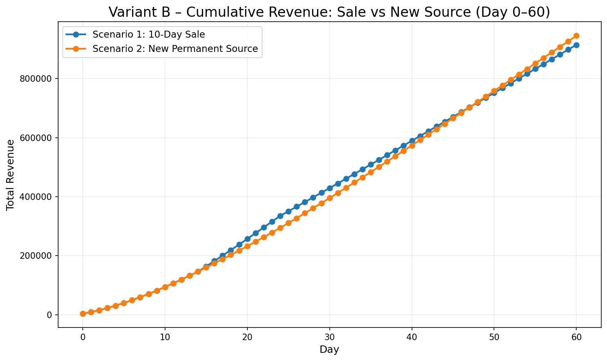

# Vertigo Games – Data Analyst Case Study  
### **Task 1: A/B Test Modeling & Simulation**  
**Author:** Atamert Bilgin  
**Tools:** Python, NumPy, Pandas, Matplotlib, Jupyter Notebook  

---

## Repository Structure
```text
├── README.md
├── requirements.txt
│
├── notebooks/
│   └── task1_ab_test.ipynb          # Main analysis & visualizations
│
├── src/
│   └── abtest/
│       ├── __init__.py
│       ├── config.py                # Constants and experiment settings
│       ├── retention.py             # Retention curve modeling
│       ├── dau.py                   # DAU simulation utilities
│       ├── monetization.py          # Revenue model (ads + IAP + sale)
│       └── scenarios.py             # Scenario helpers
│
└── outputs/
    └── figures/                     # Saved plots for README
        ├── cumulative_rev_15days.png
        ├── cumulative_rev_30days.png
        ├── cumulative_rev_with_10day_sale.png
        ├── cumulative_rev_with_new_source.png
        ├── sale_vs_new_source.png
        └── dau_over_15_days.png
```


The notebook automatically imports reusable functions from src/abtest/.

Task 1: Analysis & Findings
This analysis models an A/B test for a difficulty flow.
Each variant receives 20,000 installs/day, and we simulate:

Cohort-based retention

DAU (stacked by cohorts)

Monetization (ads + IAP)

A 10-day sale event

A new user source starting Day 20

Retention uses linear interpolation up to D14 and exponential decay afterward.

a) Which variant has more DAU after 15 days?
Variant B retains players slightly worse on Day 1 but significantly better in mid- and late-game (D7, D14).
This leads to more stacked cohorts by Day 15.
Variant B has higher DAU on Day 15.

Figure:


b) Which variant earns more up to Day 15?
Using ARPPU = 5 since there is no additional information in the case:

Variant A monetizes better per user (more impressions per DAU).

Variant B has more DAU but lower per-user ad revenue.

For this monetization level:

Variant A earns slightly more by Day 15.

Figure:


c) Which variant earns more up to Day 30?
Over longer windows, retention matters much more.

Variant B’s D7/D14 advantage compounds, and by stacking more surviving cohorts, it overtakes A.

By Day 30, Variant B earns more total revenue.

Figure:


d) What is the impact of a 10-Day Sale (Day 15–24)?
During the sale:

Purchase probability +1% absolute

DAU unchanged
IAP revenue increases sharply for 10 days
The effect is large but temporary.

Figure:


e) What is the impact of a new user source (starting Day 20)?
New flow:

12k installs/day from old source

8k installs/day from new source

New source cohorts follow exponential retention
This creates a small but permanent DAU increase every day.

Figure:


f) Sale vs. New User Source — Which Should Be Prioritized?
Comparison (Variant B shown since I think it is the superior one):

Figure:


Interpretation
The 10-day sale creates a strong short-term spike
The new user source compounds permanently

Over long horizons (45–90+ days), the new source dominates

Final Verdict:
Prioritize the permanent new user source.
A one-off sale boosts short-term IAP
a new source changes the growth trajectory of the game.

Summary
Winner is Variant B since it has better long term metrics overall.
